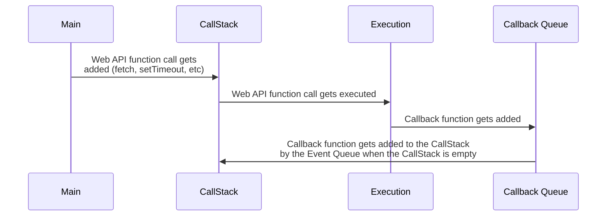

# Event Loop

JavaScript is single-threaded, but is able to execute functions asynchronously. This is made possible by the Event Loop.

Components 
- CallStack
- Callback Queue
- Event Loop

Steps
1. Function calls get added to the CallStack and are executed in a LIFO order.
2. Web API calls (fetch, setTimeout, etc.) are added to the callstack, then get executed, popping off th CallStack.
4. The callback function that that Web API gets added to the Callback Queue.
5. That function then gets added to the CallStack by the Event Loop when the CallStack is empty.
6. The callback function then gets executed.



 ```mermaid
graph TD;
    A["Web API function call"] --> B[CallStack];
    B-->C["Function gets executed"];
    C-->D["Callback Queue"];
    D-->B;
```


REF:
- https://hackernoon.com/understanding-the-javascript-event-loop-everything-you-need-to-know
